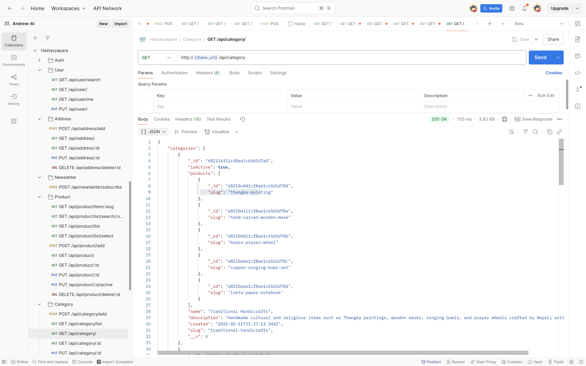
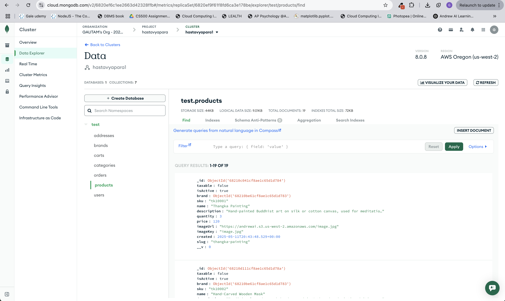
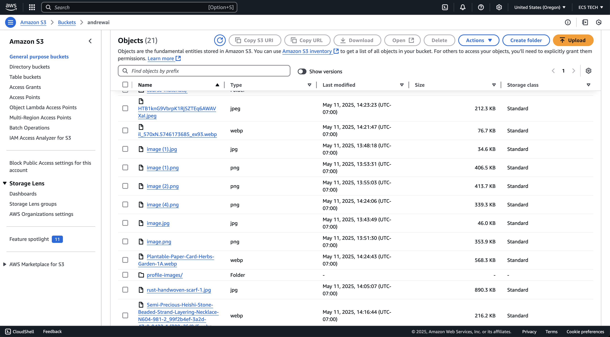

# Hastavyapara- Backend

This is the **Node.js + Express + MongoDB Backend** for the Ecommerce platform called Hastavyapara.
It provides secure REST APIs for user authentication, product management, orders, and admin dashboard functionality.

## Hastavyapara- Frontend

[## Hastavyapara- Frontend](https://github.com/prof-gautam/Hastavyapara-frontend)

## Project Purpose

- Backend REST API for ecommerce store
- Secure authentication with JWT
- MongoDB models for products, categories, users, merchants
- Role-based authorization for Admin / Merchant / User
- API documentation available via Postman collection

## Tech Stack

- Node.js
- Express
- MongoDB + Mongoose
- JWT Authentication
- bcrypt password hashing
- Mailgun (email service)
- Dockerized setup support

## Setup Instructions

### Prerequisites

- Node.js >= 18.x
- MongoDB >= 5.x

### Installation

1. Navigate to the `server` folder

```bash
cd server
npm install
```

2. Create a `.env` file based on `.env.example`

```env
PORT=3000
MONGO_URI=mongodb+srv://your mongourl
JWT_SECRET=hastavyapara_secret
CLIENT_URL=http://localhost:8080
BASE_API_URL=api
AWS_ACCESS_KEY_ID=<your_access_key>
AWS_SECRET_ACCESS_KEY=<AWS_SECRET_ACCESS_KEY>
AWS_REGION=<AWS_REGION>
AWS_BUCKET_NAME=<AWS_BUCKET_NAME>
```

3. Start the backend server

```bash
npm run dev
```

API will be running at [http://localhost:3000/api/](http://localhost:3000/api/)

## Database Seeding

To seed an initial Admin account:

```bash
npm run seed:db admin@example.com password123
```

## API Documentation

A full **Postman collection** is included in `/docs/postman_collection.json`
or import the latest collection provided for testing all endpoints.

## Sample Test Users (Optional)

| Role     | Email                | Password    |
| -------- | -------------------- | ----------- |
| Admin    | admin@example.com    | password123 |
| Merchant | merchant@example.com | password123 |
| User     | user@example.com     | password123 |

## Screenshots

Postman



Mongo Collections



AWS s3 bucket


Notes

- Sensitive environment variables are stored in `.env`
- Tested for Node 18.x + MongoDB 5.x
